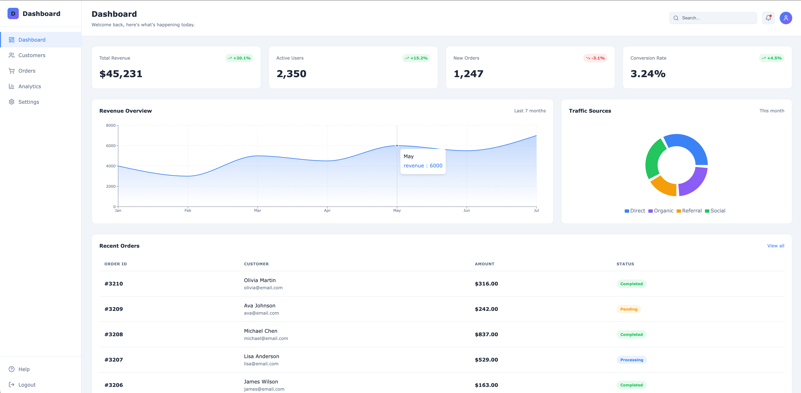
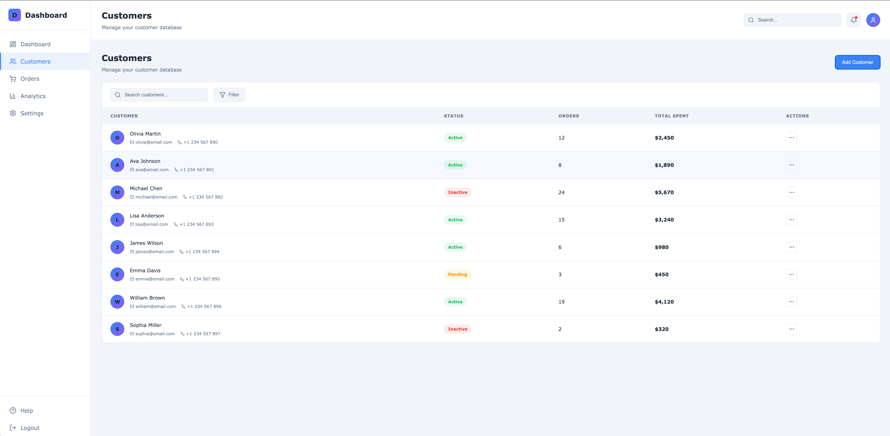
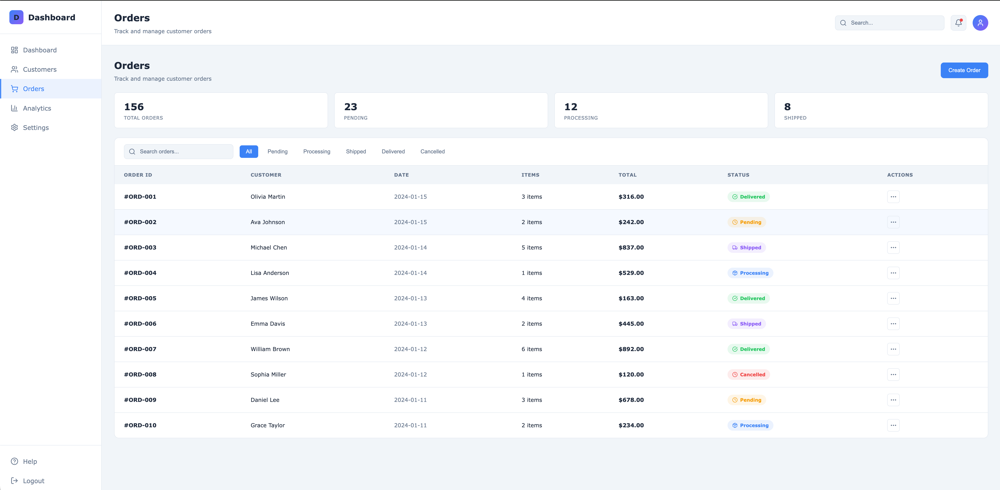
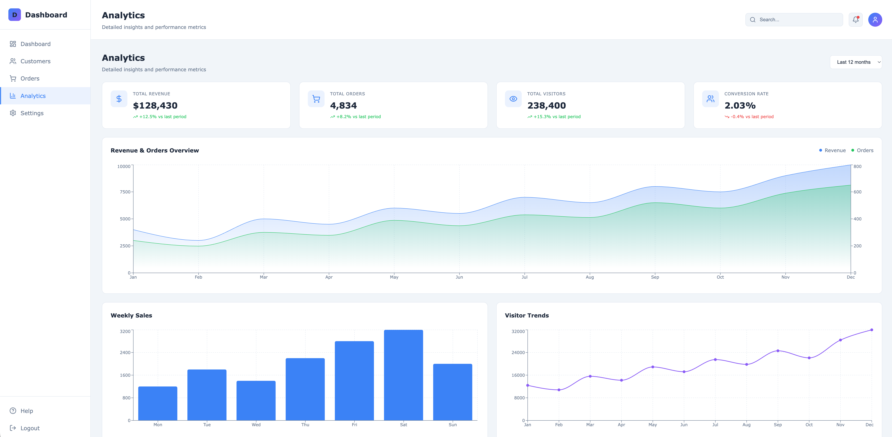
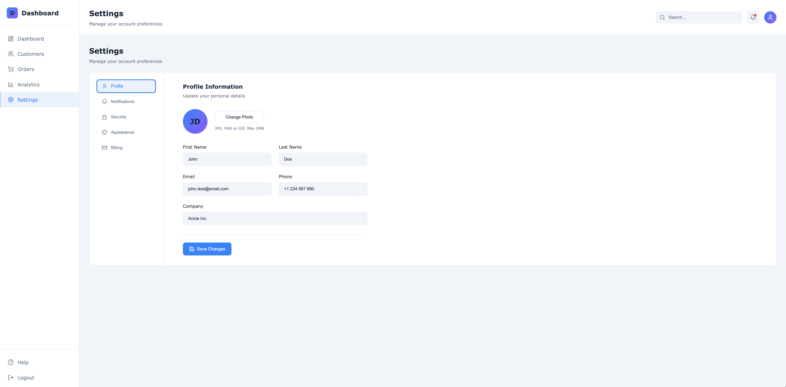
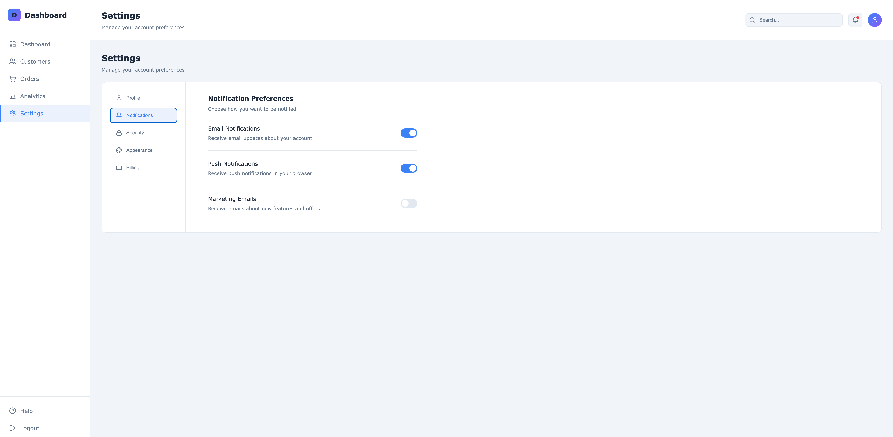
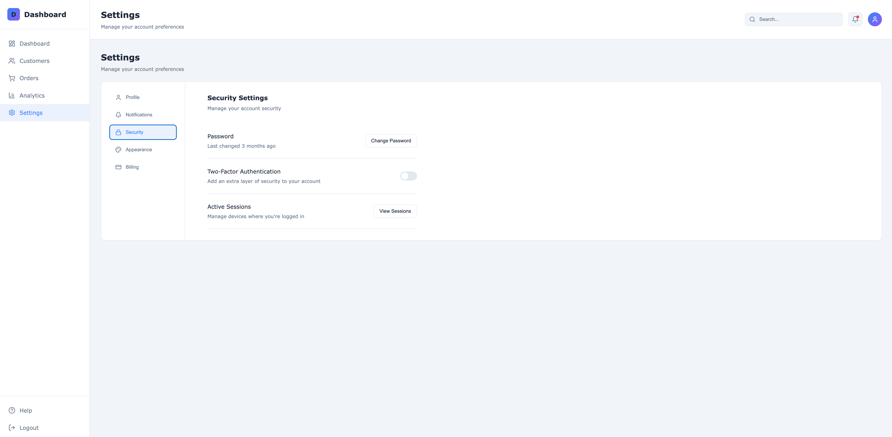
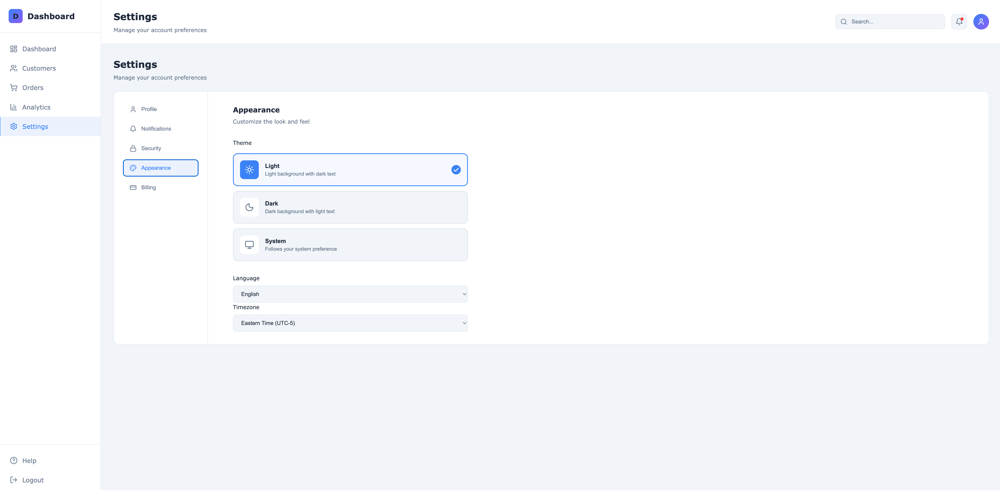
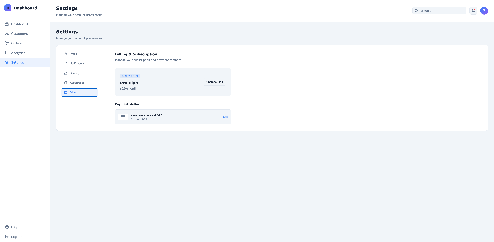

# Dashboard

A modern, feature-rich web dashboard application built with React. This project demonstrates a comprehensive administrative interface for business operations, showcasing professional frontend development practices.

## Features

- **Real-time Business Metrics** - Display KPIs including revenue, active users, orders, and conversion rates
- **Customer Management** - Searchable customer database with status tracking
- **Order Tracking** - Order management with filtering by status (Pending, Processing, Shipped, Delivered, Cancelled)
- **Analytics Dashboard** - Interactive charts and performance metrics visualization
- **User Settings** - Profile management, notifications, security, and appearance customization
- **Theme Support** - Light/dark mode with system preference detection and localStorage persistence

## Tech Stack

### Core

- **React 19** - UI library for building component-based interfaces
- **React Router DOM 7** - Client-side routing and navigation
- **Vite 7** - Modern frontend build tool with HMR

### Data Visualization

- **Recharts 3** - React charting library (Area, Bar, Line, Pie charts)

### UI Components

- **Lucide React** - Lightweight SVG icon library

### Development Tools

- **ESLint 9** - JavaScript linting with React hooks plugin
- **TypeScript definitions** - Type support for React

## Architecture

```
src/
├── components/          # Reusable UI components
│   ├── Sidebar.jsx      # Navigation sidebar
│   ├── Header.jsx       # Page header with search & notifications
│   ├── StatsCard.jsx    # Metric display cards
│   ├── Charts.jsx       # Chart components (Revenue, Traffic)
│   └── RecentOrders.jsx # Orders table component
│
├── pages/               # Page-level components
│   ├── Dashboard.jsx    # Main dashboard with stats & charts
│   ├── Customers.jsx    # Customer management
│   ├── Orders.jsx       # Order tracking & filtering
│   ├── Analytics.jsx    # Detailed analytics view
│   └── Settings.jsx     # User settings (Profile, Security, etc.)
│
├── context/             # React Context providers
│   └── ThemeContext.jsx # Global theme state management
│
├── data/                # Mock data
│   └── dashboardData.js # Static data for charts & tables
│
├── App.jsx              # Root component with routing
├── main.jsx             # Application entry point
└── index.css            # Global styles & CSS variables
```

### Design Patterns

- **Component-Based Architecture** - Modular, reusable UI components
- **Context API** - Global state management for theming
- **CSS Modules Pattern** - Component-scoped styling
- **Responsive Design** - CSS Grid and Flexbox layouts

### Application Flow

```
main.jsx (Entry)
  └── ThemeProvider (Global Theme Context)
        └── App.jsx (Router)
              ├── Sidebar (Navigation)
              ├── Header (Page Title & Utilities)
              └── Routes
                    ├── / → Dashboard
                    ├── /customers → Customers
                    ├── /orders → Orders
                    ├── /analytics → Analytics
                    └── /settings → Settings
```

## Getting Started

### Prerequisites

- Node.js 18+
- npm or yarn

### Installation

```bash
# Install dependencies
npm install

# Start development server
npm run dev

# Build for production
npm run build

# Preview production build
npm run preview

# Run linting
npm run lint
```

## Pages Overview

| Page | Route | Description |
|------|-------|-------------|
| Dashboard | `/` | Overview with stats, charts, and recent orders |
| Customers | `/customers` | Customer database with search functionality |
| Orders | `/orders` | Order management with status filtering |
| Analytics | `/analytics` | Detailed charts and performance metrics |
| Settings | `/settings` | User preferences and account settings |

## License

MIT

## Video Demo

- Watch the demo: [YouTube](https://youtu.be/fL-ebBTUIF8)

## Screenshots

#### Dashboard Page


#### Customer Page


#### Order Page


#### Analytics Page


#### Settings - Profile Page


#### Settings - Notifications Page


#### Settings - Security Page


#### Settings - Appearance Page


#### Settings - Billing Page
