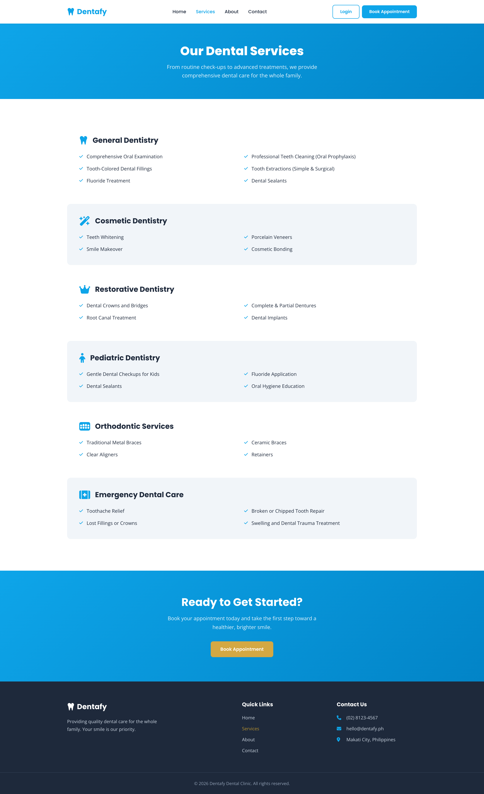
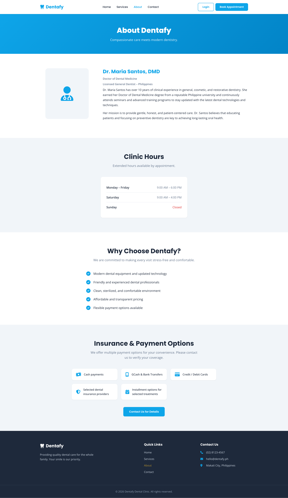
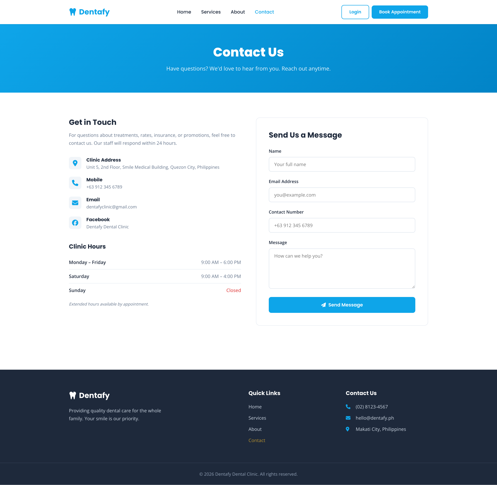
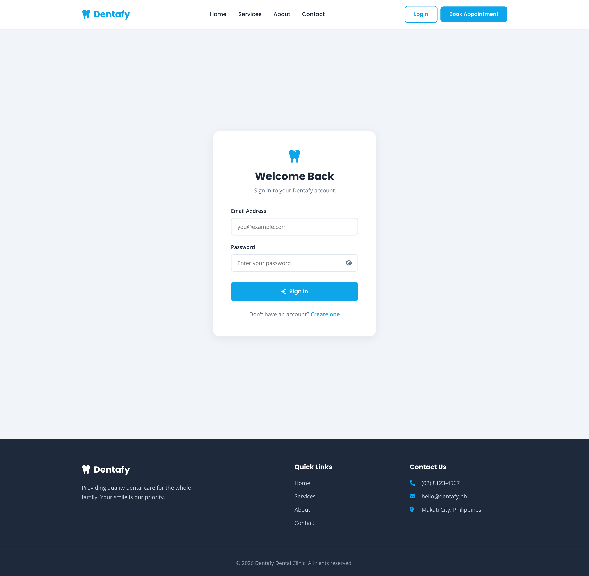
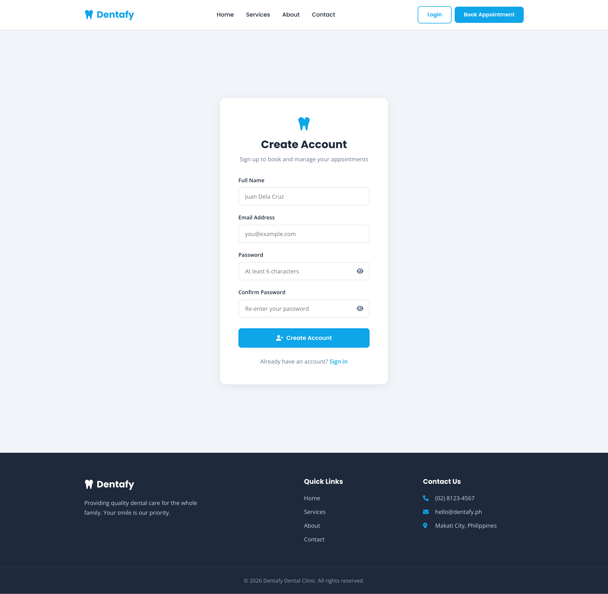
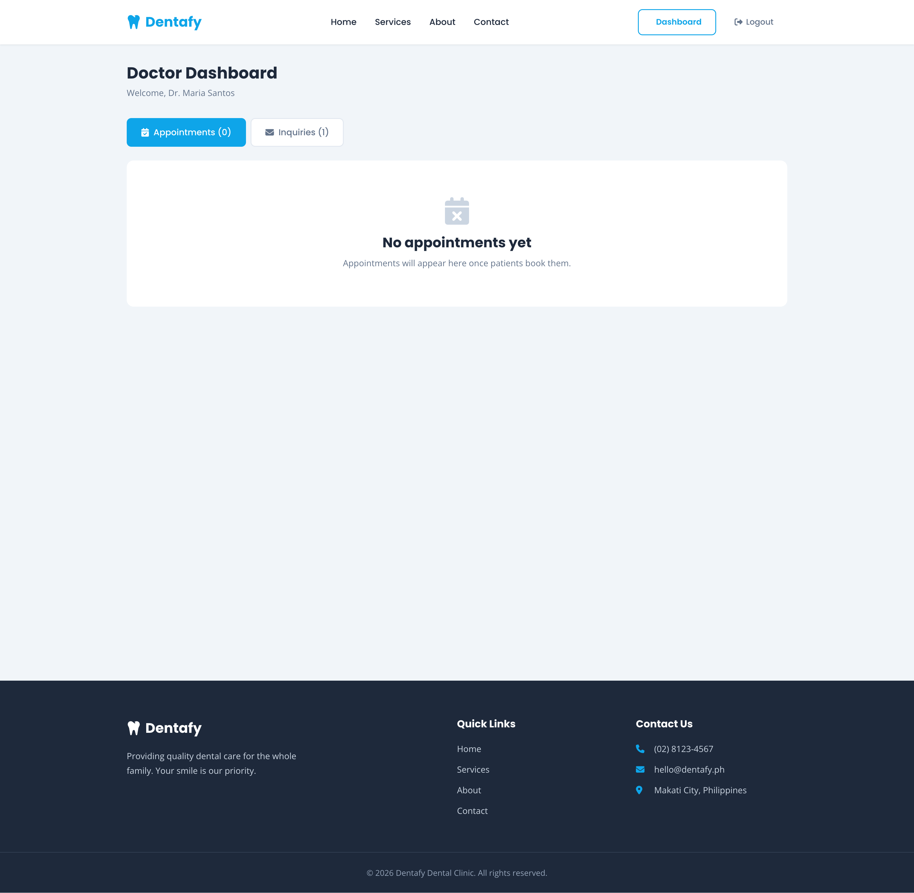
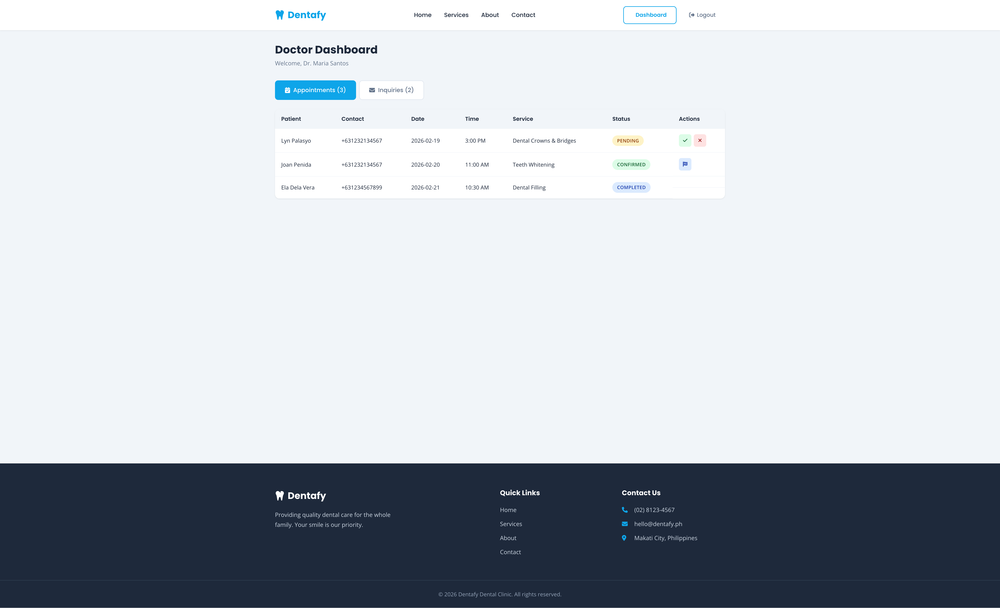
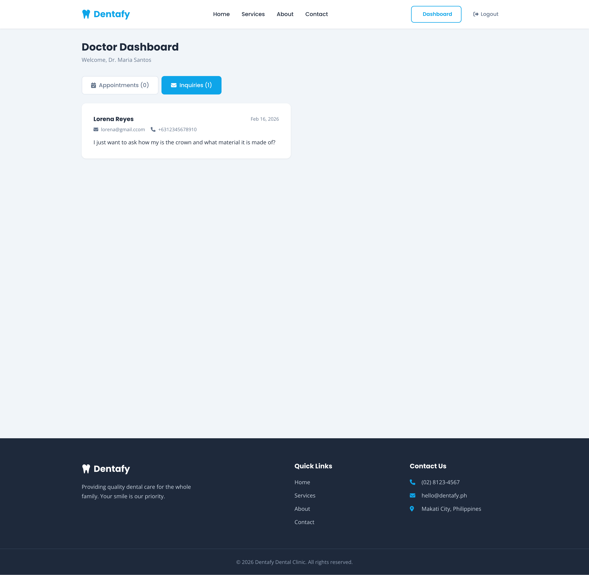
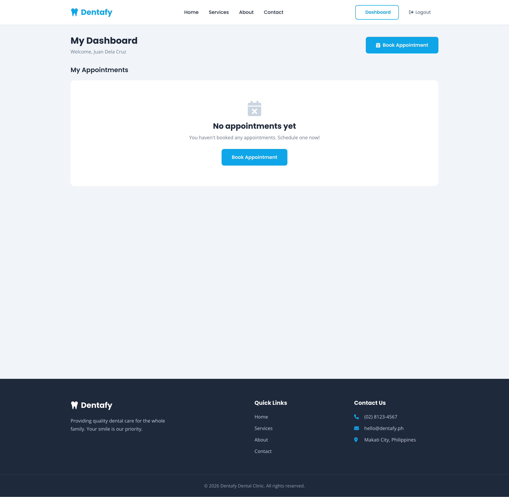
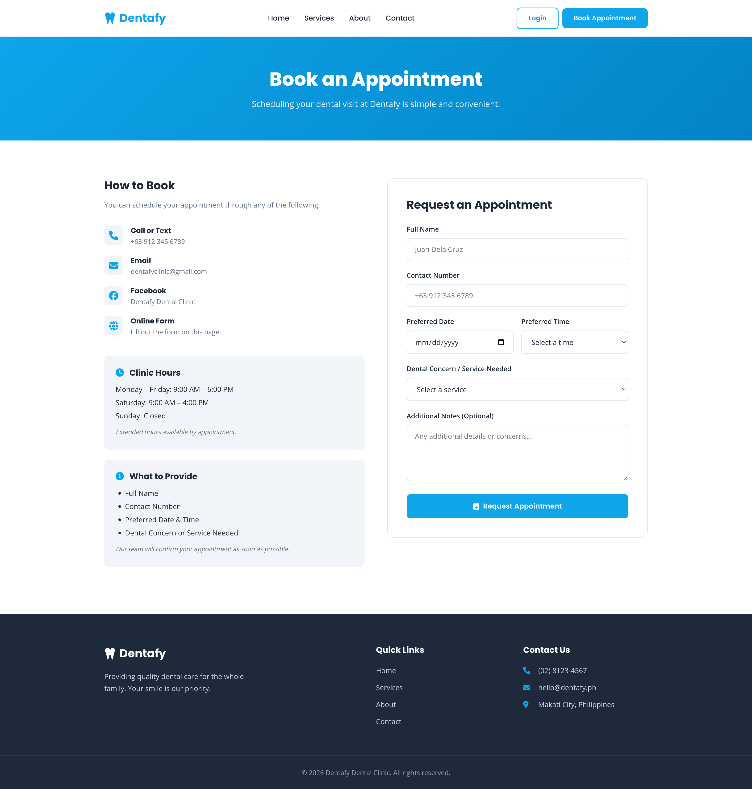

# Dentafy Dental Clinic

A full-stack dental clinic web application with appointment booking, contact inquiries, and role-based dashboards for doctors and customers.

## Tech Stack

| Layer | Technology |
|-------|-----------|
| Frontend | Angular 21, TypeScript, SCSS |
| Backend | Express.js, Apollo Server (GraphQL), TypeScript |
| Database | PostgreSQL via Prisma 7 |
| Auth | JWT (jsonwebtoken) + bcryptjs |
| Icons | Font Awesome 6.5.1 |
| Fonts | Google Fonts (Poppins, Open Sans) |

## Architecture

```
dentafy/
├── backend/                  # GraphQL API server (port 4000)
│   ├── prisma/
│   │   ├── schema.prisma     # Database models
│   │   ├── config.ts         # Prisma migration config
│   │   └── seed.ts           # Seed data (services, testimonials, doctor account)
│   └── src/
│       ├── index.ts          # Express + Apollo Server setup
│       ├── schema.ts         # GraphQL type definitions
│       ├── resolvers.ts      # GraphQL resolvers
│       ├── auth.ts           # JWT + bcrypt utilities
│       └── generated/prisma/ # Auto-generated Prisma client
│
└── front-end/                # Angular SPA (port 4200)
    └── src/app/
        ├── styles/
        │   ├── _variables.scss    # Shared colors, fonts, breakpoints
        │   ├── _page-hero.scss    # Page hero banner
        │   ├── _cta.scss          # Call-to-action section
        │   ├── _forms.scss        # Form wrapper, success message
        │   ├── _auth.scss         # Auth page layout (login/register)
        │   └── _dashboard.scss    # Dashboard layout, badges, states
        ├── components/
        │   ├── header/       # Sticky nav with auth-aware UI
        │   └── footer/       # Site footer with links
        ├── pages/
        │   ├── home/         # Landing page
        │   ├── services/     # Dental services listing
        │   ├── about/        # Doctor bio, hours, payment options
        │   ├── contact/      # Contact info + inquiry form
        │   ├── book/         # Appointment booking form
        │   ├── login/        # Login page
        │   ├── register/     # Customer registration
        │   ├── doctor/       # Doctor dashboard (appointments + inquiries)
        │   └── customer/     # Customer dashboard (my appointments)
        ├── services/
        │   ├── api.service.ts       # GraphQL HTTP client
        │   ├── auth.service.ts      # Auth state management (signals)
        │   └── auth.interceptor.ts  # JWT token interceptor
        └── guards/
            └── auth.guard.ts        # Route guards (authGuard, roleGuard)
```

## Database Models

| Model | Description |
|-------|------------|
| User | id, email, password (hashed), name, role (DOCTOR/CUSTOMER) |
| Appointment | id, fullName, contactNumber, preferredDate/Time, dentalConcern, status, userId |
| Inquiry | id, name, email, contactNumber, message |
| Service | id, category, title, icon, sortOrder |
| Testimonial | id, quote, author |

## Pages & Routes

| Route | Page | Access |
|-------|------|--------|
| `/` | Home | Public |
| `/services` | Dental Services | Public |
| `/about` | About the Doctor | Public |
| `/contact` | Contact + Inquiry Form | Public |
| `/book` | Book Appointment | Public |
| `/login` | Login | Public |
| `/register` | Customer Registration | Public |
| `/doctor` | Doctor Dashboard | Doctor only |
| `/customer` | Customer Dashboard | Customer only |

## Login Credentials

### Doctor Account (pre-seeded)

- **Email:** `doctor@dentafy.ph`
- **Password:** `doctor123`
- **Access:** View all appointments, update statuses (confirm/cancel/complete), view all contact inquiries

### Customer Account (pre-seeded)

- **Email:** `customer@dentafy.ph`
- **Password:** `customer123`
- **Access:** Book appointments, view own appointment history

You can also register a new customer account at `/register`.

## Getting Started

### Prerequisites

- Node.js 22+
- npm 10+

### 1. Start the database

```bash
cd backend
npx prisma dev
```

Keep this terminal running. It starts a local ephemeral PostgreSQL instance.

### 2. Set up and start the backend

In a new terminal:

```bash
cd backend
npm install
npx prisma migrate dev --name init
npx prisma generate
npm run seed
npm run dev
```

The GraphQL API will be running at `http://localhost:4000/graphql`.

### 3. Start the frontend

In a new terminal:

```bash
cd front-end
npm install
npm start
```

The app will be running at `http://localhost:4200`.

## Backend Commands

| Command | Description |
|---------|------------|
| `npm run dev` | Start dev server with hot reload |
| `npm run start` | Start server |
| `npm run build` | Compile TypeScript |
| `npm run seed` | Seed database with services, testimonials, and doctor account |
| `npm test` | Run unit tests (Vitest) |

## Frontend Commands

| Command | Description |
|---------|------------|
| `npm start` | Start Angular dev server |
| `npm run build` | Production build |
| `npm test` | Run unit tests (Vitest) |

## Testing

Both the backend and frontend use [Vitest](https://vitest.dev/) for unit testing.

### Backend Tests (31 tests)

```bash
cd backend
npm test
```

| File | Tests | Description |
|------|-------|-------------|
| `src/auth.spec.ts` | 9 | Password hashing/verification, JWT creation/validation |
| `src/resolvers.spec.ts` | 22 | All GraphQL queries and mutations with mocked Prisma |

### Frontend Tests (57 tests)

```bash
cd front-end
npm test
```

| File | Tests | Description |
|------|-------|-------------|
| `services/auth.service.spec.ts` | 9 | Token storage, login state, role management, logout |
| `services/api.service.spec.ts` | 9 | All GraphQL mutations/queries with mocked HttpClient |
| `services/auth.interceptor.spec.ts` | 2 | JWT Bearer token injection |
| `guards/auth.guard.spec.ts` | 5 | Auth guard and role-based guard with redirects |
| `pages/login/login.spec.ts` | 8 | Form validation, login submit, role-based redirect |
| `pages/book/book.spec.ts` | 8 | Booking form validation, submit, error handling |
| `pages/contact/contact.spec.ts` | 10 | Contact form validation (email, minLength), submit |
| `components/header/header.spec.ts` | 4 | Dashboard link based on user role |
| `app.spec.ts` | 2 | Root component creation, header rendering |

## Shared SCSS Partials

Reusable styles live in `src/app/styles/` and are imported via `@use`. The `includePaths` option in `angular.json` allows short imports like `@use 'variables' as *`.

| Partial | Purpose | Used by |
|---------|---------|---------|
| `_variables` | Colors, fonts, breakpoints | All components + `styles.scss` |
| `_page-hero` | Gradient hero banner | services, about, contact, book |
| `_cta` | Call-to-action section | home, services |
| `_forms` | Form wrapper, row layout, submit error, success message | contact, book |
| `_auth` | Centered auth card layout | login, register |
| `_dashboard` | Dashboard layout, status badges, loading/empty states | doctor, customer |

## GraphQL API

### Public Queries
- `services` — All dental services
- `testimonials` — Patient testimonials

### Public Mutations
- `login(input: LoginInput!)` — Returns JWT token + user
- `register(input: RegisterInput!)` — Customer registration
- `createAppointment(input: AppointmentInput!)` — Book an appointment
- `createInquiry(input: InquiryInput!)` — Submit a contact inquiry

### Authenticated Queries
- `me` — Current logged-in user
- `myAppointments` — Customer's own appointments

### Doctor-Only Queries
- `allAppointments` — All appointments
- `allInquiries` — All contact inquiries

### Doctor-Only Mutations
- `updateAppointmentStatus(id, status)` — Update appointment status (PENDING, CONFIRMED, CANCELLED, COMPLETED)

## Video Demo

- Watch the demo: [YouTube](https://youtu.be/69XHbjm6Yr0)


### Screenshots

#### Home


#### Services


#### About


#### Contact


#### Login


#### Create Account


#### Doctor's Dashboard


#### Doctor's Dashboard with Appointments


#### Doctor's Inquiries


#### Customer's Dashboard


#### Book Appointment
