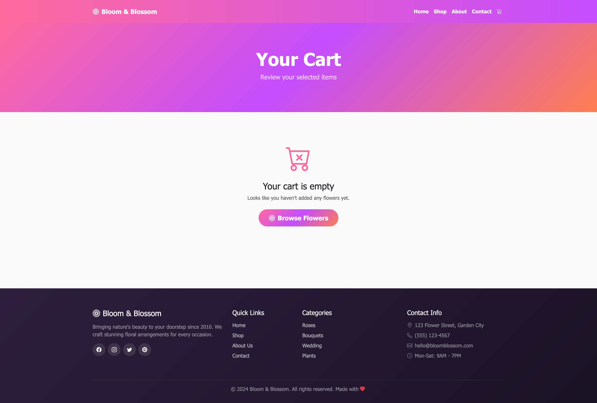

# Flower Shop

A modern e-commerce web application for browsing and purchasing flowers.

## Features

- Browse flower catalog with product cards
- Shopping cart with localStorage persistence
- Responsive design with Bootstrap

## Technologies

- **React 19** - UI framework
- **Vite 7** - Build tool with HMR
- **React Router DOM 7** - Client-side routing
- **Bootstrap 5 / React-Bootstrap** - UI components
- **Bootstrap Icons** - Icon library

## Architecture

```
src/
├── components/       # Reusable UI (Navbar, Footer, FlowerCard)
├── pages/            # Route pages (Home, Shop, About, Contact, Cart)
├── context/          # CartContext for state management
├── App.jsx           # Main app with routing
└── main.jsx          # Entry point
```

## Getting Started

```bash
npm install    # Install dependencies
npm run dev    # Start dev server
npm run build  # Build for production
```

## Video Demo

- Watch the demo: [YouTube](https://youtu.be/OcnUiuv75rM)
  

## Screenshots

#### Home Page


#### Shop Page


#### About Page


#### Contact Page


#### Cart Page

