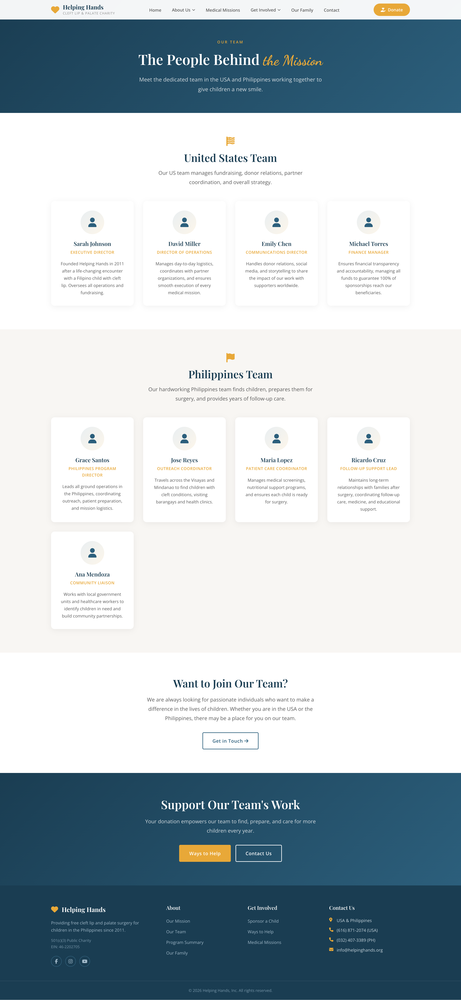
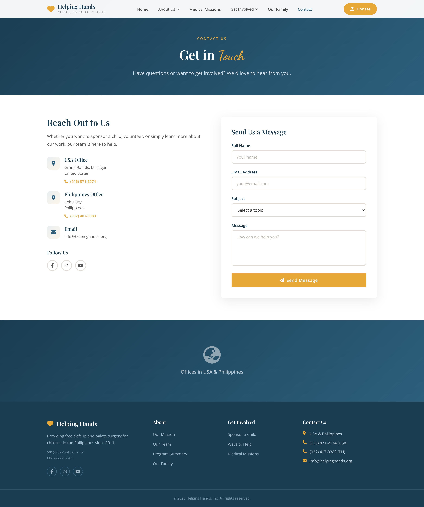

# Helping Hands

A charity website for **Helping Hands, Inc.** — a 501(c)(3) nonprofit providing free cleft lip and palate surgery for children in the Philippines. Built with Angular 21.

## Project Description

Helping Hands is a multi-page informational website for a cleft lip and palate charity. The site showcases the organization's mission, medical mission programs, child sponsorship options, team members, and family stories. It includes a contact form, filtering capabilities on the family page, and a fully responsive design that works across all devices.

### Key Features

- **Home** — Hero section, impact statistics, "How We Help" process, partner logos, and call-to-action
- **Our Mission** — Origin story, "What We Do" card grid, and core values
- **Program Summary** — Impact stats and a 6-step alternating timeline
- **Medical Missions** — Upcoming/past missions, how missions work, and partner organizations
- **Sponsorships** — 4 sponsorship tiers ($25–$250), guarantee badges, and sponsor steps
- **Ways You Can Help** — 6 ways to contribute, impact breakdown, and FAQ accordion
- **Our Family** — Filterable gallery of children (all / post-surgery / awaiting surgery) with profile cards
- **Our Team** — USA and Philippines team members with roles and bios
- **Contact** — Contact form with validation, office locations (USA & Philippines), and social links

## Technologies

| Category | Technology | Version |
|---|---|---|
| Framework | Angular | 21.1.0 |
| Language | TypeScript | 5.9.2 |
| Styling | SCSS | — |
| Fonts | Google Fonts (Playfair Display, Open Sans, Dancing Script) | — |
| Icons | Font Awesome | 6.5.1 |
| Reactive State | Angular Signals | — |
| Forms | Angular FormsModule (template-driven) | — |
| Routing | Angular Router | — |
| Build Tool | Angular CLI / @angular/build | 21.1.3 |
| Package Manager | npm | 10.9.4 |

## Architecture

```
src/
├── index.html                  # Entry HTML (Google Fonts, Font Awesome CDN)
├── main.ts                     # Bootstrap entry point
├── styles.scss                 # Global styles, variables, utilities
└── app/
    ├── app.ts                  # Root component (imports Header, Footer, RouterOutlet)
    ├── app.routes.ts           # Route definitions (9 routes + wildcard)
    ├── app.config.ts           # Application configuration
    ├── components/
    │   ├── header/             # Fixed navigation, mobile menu, scroll effect
    │   └── footer/             # 4-column footer with links, contact info, social
    └── pages/
        ├── home/               # Landing page with hero, stats, process, partners
        ├── mission/            # Mission statement, "What We Do", values
        ├── program-summary/    # Impact stats, 6-step timeline
        ├── medical-missions/   # Upcoming/past missions, partners
        ├── sponsorships/       # Sponsorship tiers, guarantees, steps
        ├── ways-to-help/       # Ways to contribute, impact, FAQ
        ├── our-family/         # Filterable children gallery with signals/computed
        ├── our-team/           # USA & Philippines team members
        └── contact/            # Contact form with template-driven validation
```

### Design Patterns

- **Standalone Components** — All components use Angular's standalone architecture (no NgModules)
- **Angular Signals** — Reactive state management using `signal()` and `computed()` for filtering and UI state
- **Template Control Flow** — Uses `@if`, `@else`, and `@for` syntax (Angular 17+)
- **Component-scoped SCSS** — Each component has its own stylesheet with shared SCSS variables
- **Responsive Design** — Breakpoints at 480px, 600px, 768px, 1024px, and 1280px

### SCSS Variables

```scss
$primary: #2c5f7c;
$primary-dark: #1a3d52;
$accent: #e8a838;
$white: #ffffff;
$off-white: #f8f6f3;
```

### Typography

- **Headings** — Playfair Display (serif)
- **Body** — Open Sans (sans-serif)
- **Accent/Script** — Dancing Script (cursive)

## Getting Started

### Prerequisites

- Node.js 18+
- npm 10+

### Installation

```bash
npm install
```

### Development Server

```bash
ng serve
```

Navigate to `http://localhost:4200/`. The app automatically reloads on file changes.

### Production Build

```bash
ng build
```

Build artifacts are output to the `dist/` directory.


## Video Demo

- Watch the demo: [YouTube](https://youtu.be/VyG3eNxLvXY)


### Screenshots

#### Home


#### Our Mission


#### Our Team


#### Program Summary


#### Medical Mission


#### Sponsorships


#### Ways You Can Help / Donation


#### Our Family


#### Contact Us
