# KaGuro Ph

An educational materials marketplace inspired by [kaguro.ph](https://kaguro.ph/). Built with Next.js 16, React 19, Tailwind CSS v4, PostgreSQL, and Prisma 7.

## Project Description

KaGuro Ph is a digital marketplace where Filipino teachers can share, sell, and discover quality educational materials designed for the classroom. The platform features DepEd-aligned resources including lesson plans, worksheets, classroom decors, templates, forms, and Canva templates.

### Key Features

- **Homepage** — Hero banner, "How It Works" steps, featured products grid, stats, testimonial, and CTAs
- **Store** — Product grid with category sidebar filtering, search, sorting, and pagination
- **Product Detail** — Full product view with image, rating, vendor info, add to cart, and related products
- **Shopping Cart** — Slide-out cart drawer and full cart page with quantity controls and order summary
- **FAQs** — Accordion sections for General, Customers, Vendors, and Affiliate Marketers
- **Contact** — Contact form with phone, email, and social links
- **Copyright** — Intellectual property policy page
- **Authentication** — Sign in and sign up with JWT sessions, password visibility toggle
- **Admin Dashboard** — Protected admin panel with sidebar navigation
  - Dashboard stats (users, products, orders, revenue)
  - Users, Products, Vendors, Testimonials management
  - Account settings with profile and password update

## Technologies

| Category | Technology | Version |
|---|---|---|
| Framework | Next.js (App Router) | 16.1.6 |
| UI Library | React | 19.2.3 |
| Language | TypeScript | 5.x |
| Styling | Tailwind CSS | 4.0 (with @theme) |
| Database | PostgreSQL | 8.18.0 |
| ORM | Prisma | 7.3.0 |
| Database Adapter | Prisma Adapter for Postgres | 7.3.0 |
| Performance | Prisma Accelerate | 3.0.1 |
| Authentication | jose (JWT) | 6.1.3 |
| Password Hashing | bcryptjs | 3.0.3 |
| Carousel | Embla Carousel React | 8.6.0 |
| Icons | Lucide React | 0.563.0 |
| Build Tool | Turbopack | — |
| Compiler | React Compiler (Babel plugin) | 1.0.0 |

## Architecture

```
src/
├── app/
│   ├── layout.tsx                    # Root layout (Lato font, Header, Footer, CartProvider)
│   ├── page.tsx                      # Homepage (featured products, testimonials, search form)
│   ├── loading.tsx                   # Loading skeleton UI
│   ├── globals.css                   # Tailwind 4.0 with @theme custom tokens
│   ├── api/                          # API routes (auth, cart, etc.)
│   ├── store/
│   │   ├── page.tsx                  # Store listing with StoreContent component
│   │   └── [slug]/
│   │       └── page.tsx              # Product detail (server component)
│   ├── cart/
│   │   └── page.tsx                  # Cart page (client component)
│   ├── vendor/
│   │   └── page.tsx                  # Vendor dashboard
│   ├── faqs/
│   │   └── page.tsx                  # FAQs with accordion
│   ├── contact/
│   │   └── page.tsx                  # Contact form
│   ├── copyright/
│   │   └── page.tsx                  # Legal/copyright info
│   ├── sign-in/
│   │   └── page.tsx                  # Authentication UI
│   ├── sign-up/
│   │   └── page.tsx                  # Registration UI
│   └── admin/
│       ├── layout.tsx                # Admin layout with sidebar
│       ├── page.tsx                  # Admin dashboard
│       ├── AdminSidebar.tsx          # Navigation sidebar
│       ├── users/page.tsx            # User management
│       ├── products/page.tsx         # Product management
│       ├── vendors/page.tsx          # Vendor management
│       ├── testimonials/page.tsx     # Testimonial management
│       └── settings/page.tsx         # Admin settings
├── components/
│   ├── Header.tsx                    # Sticky nav, mobile menu, cart badge, active indicators
│   ├── Footer.tsx                    # 4-column footer
│   ├── ProductCard.tsx               # Product card with add to cart
│   ├── CartDrawer.tsx                # Slide-out cart drawer
│   ├── FaqAccordion.tsx              # Collapsible FAQ accordion
│   ├── TestimonialCarousel.tsx       # Embla carousel with testimonials
│   ├── NavigationProgress.tsx        # Page loading indicator
│   └── StoreContent.tsx              # Store page with filters & search
├── context/
│   ├── CartContext.tsx               # Cart state management (React Context)
│   └── AuthContext.tsx               # Authentication state (if applicable)
├── lib/
│   └── prisma.ts                     # Prisma client singleton (pg adapter)
├── generated/
│   └── prisma/                       # Prisma generated types
└── vendor/                           # Vendor-specific components
    └── page.tsx
```

### Design Tokens (Tailwind @theme)

```css
--color-primary: #fb1993           /* Pink */
--color-primary-dark: #4a2fd6      /* Purple */
--color-secondary: #fb1993         /* Pink */
--color-secondary-dark: #fb1993    /* Pink Dark */
--color-text-dark: #243963         /* Dark blue */
--color-light-bg: #F2F0FE          /* Light purple */
--color-light-gray: #f8f9fa        /* Light gray */
--color-yellow: #eebb26            /* Yellow accent */
--color-skyblue: #bbf5f7           /* Sky blue */
--color-skyblue-dark: #a6f2f4      /* Sky blue dark */
--color-lightyellow: #fff8e1       /* Light yellow */
--color-lightyellow-dark: #fff0cb  /* Light yellow dark */
--font-sans: "Lato", sans-serif    /* Primary font */
```

### Design Patterns

- **Server & Client Components** - Optimal Next.js 16 with App Router
- **Context API** - Global state management for cart and authentication
- **Tailwind CSS 4.0 @theme** - Centralized design tokens as CSS variables
- **Component Composition** - Reusable UI components with flexible prop patterns
- **Responsive Design** - Tailwind utilities (mobile-first approach)
- **Active State Detection** - usePathname() for header nav indicators
- **Carousel with Embla** - Performance-optimized testimonial carousel
- **React Compiler** - Babel plugin for automatic optimization

### Application Flow

```
Layout.tsx (Root)
  ├── Header (Navigation with active indicators)
  ├── CartProvider (Context wrapper)
  │   └── Page Routes
  │       ├── / → Homepage (featured, testimonials, search)
  │       ├── /store → Product listing & filtering
  │       ├── /store/[slug] → Product detail
  │       ├── /cart → Shopping cart
  │       ├── /vendor → Vendor dashboard
  │       ├── /faqs → FAQs accordion
  │       ├── /contact → Contact form
  │       ├── /copyright → IP policy
  │       ├── /sign-in → Login
  │       ├── /sign-up → Registration
  │       └── /admin (Protected)
  │           ├── /admin → Dashboard stats
  │           ├── /admin/users → User management
  │           ├── /admin/products → Product management
  │           ├── /admin/vendors → Vendor management
  │           ├── /admin/testimonials → Testimonial management
  │           └── /admin/settings → Admin settings
  └── Footer (Contact & links)
```

### Database Schema

- **User** — id, name, email, password, role (CUSTOMER/VENDOR/ADMIN)
- **Category** — id, name, slug
- **Product** — id, title, slug, description, price, image, rating, downloads, categoryId, vendorId
- **Order** — id, userId, total, status (PENDING/COMPLETED/CANCELLED)
- **OrderItem** — id, orderId, productId, price
- **Testimonial** — id, quote, author, role, active, createdAt

## Demo Accounts

After seeding the database, you can sign in with these credentials:

| Role | Email | Password |
|---|---|---|
| Admin | `admin@kaguro.ph` | `password123` |
| Vendor | `maria@kaguro.ph` | `password123` |
| Vendor | `jose@kaguro.ph` | `password123` |
| Customer | `juan@kaguro.ph` | `password123` |

> Admin users have access to the admin dashboard at `/admin`.

## Getting Started

### Prerequisites

- Node.js 18+
- npm 10+

### Installation

```bash
npm install
```

### Database Setup

```bash
# Start local Prisma Postgres server
npx prisma dev

# In a separate terminal, run migrations
npx prisma migrate dev

# Seed with dummy data (16 products, 6 categories, 4 users, 4 testimonials)
npm run seed
```

### Development Server

```bash
npm run dev
```

Navigate to `http://localhost:3000`.

### Production Build

```bash
npm run build
npm start
```


## Video Demo

- Watch the demo: 
[Kaguro - Main Page](https://youtu.be/wJ3UH23ombE)
[Kaguro - Vendor](https://youtu.be/BMNakytP97Y)
[Kaguro - Admin](https://youtu.be/snubukxxV7o)


### Screenshots

#### Home


#### Store


#### Product Preview
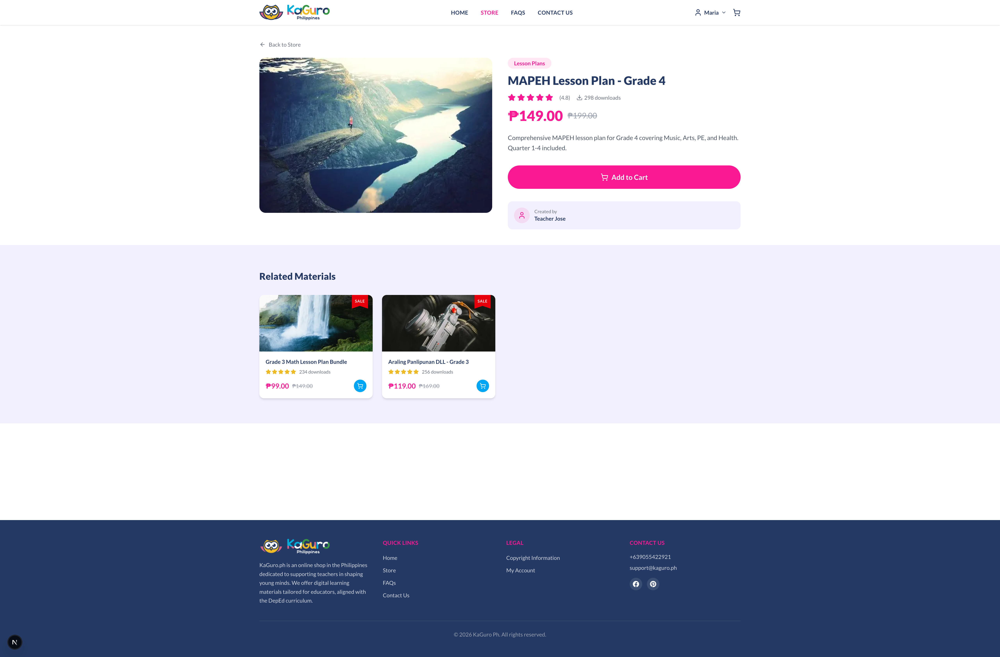

#### Faqs
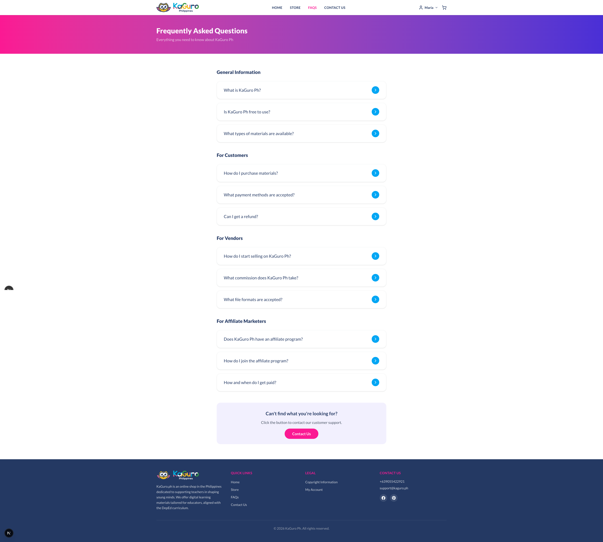

#### Contact Us
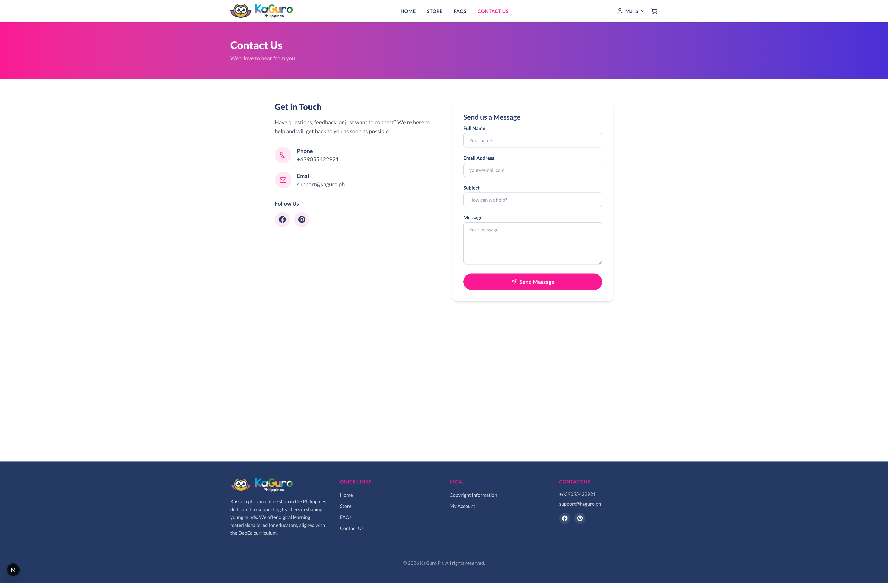

#### Vendor Panel - Dashboard
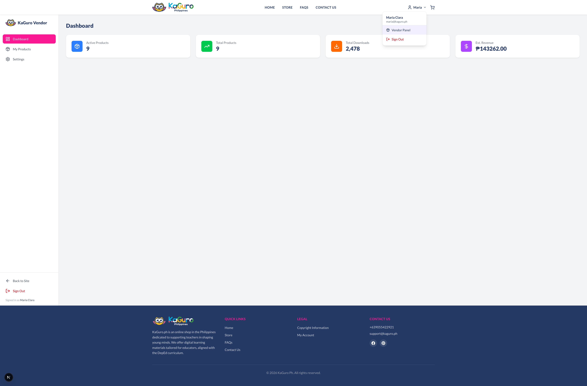

#### Vendor Panel - My Product
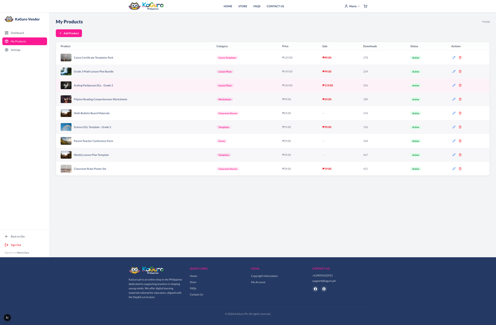

#### Vendor Panel - Settings
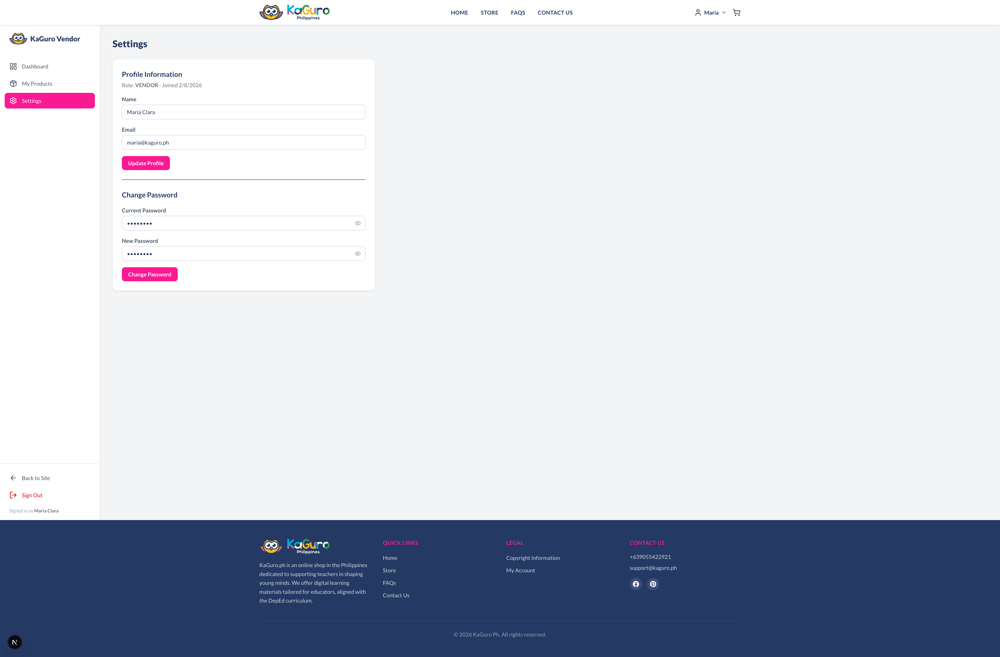

#### Signin
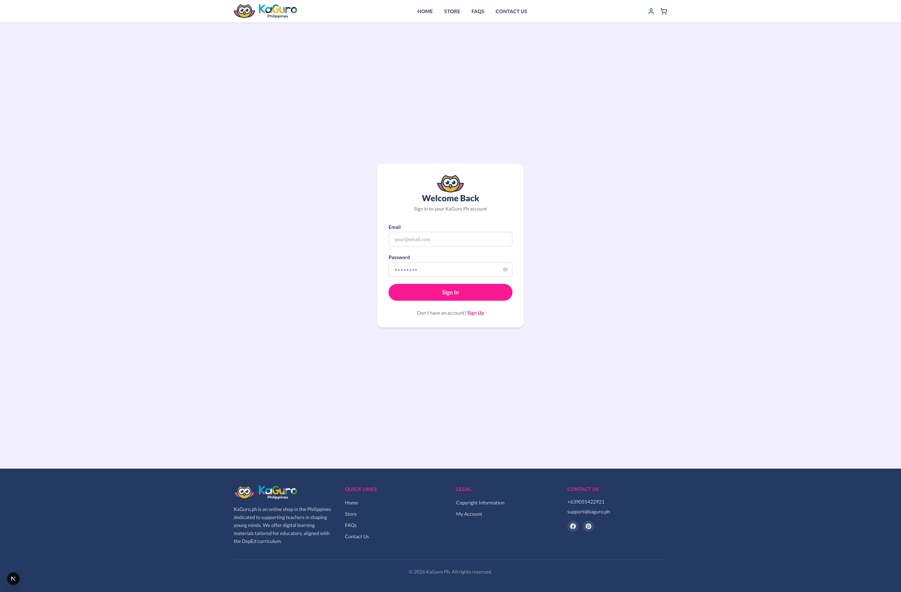

#### Signup
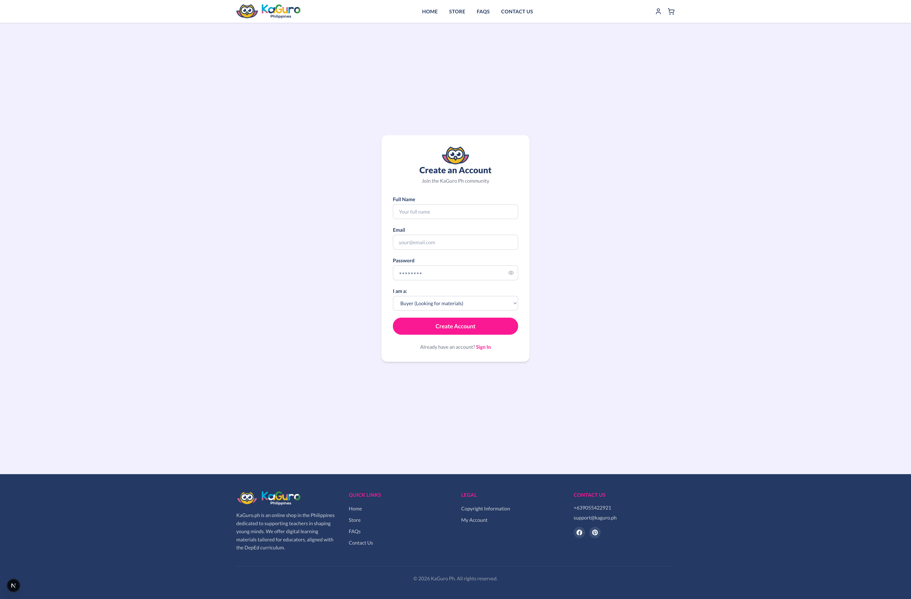

#### Admin Panel - Dashboard
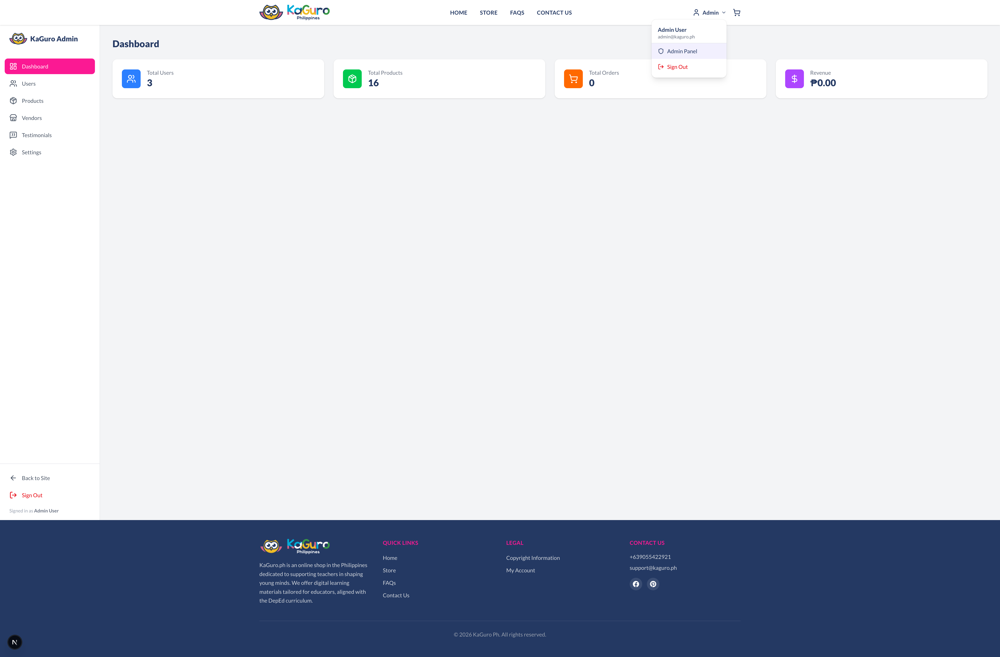

#### Admin Panel - Users
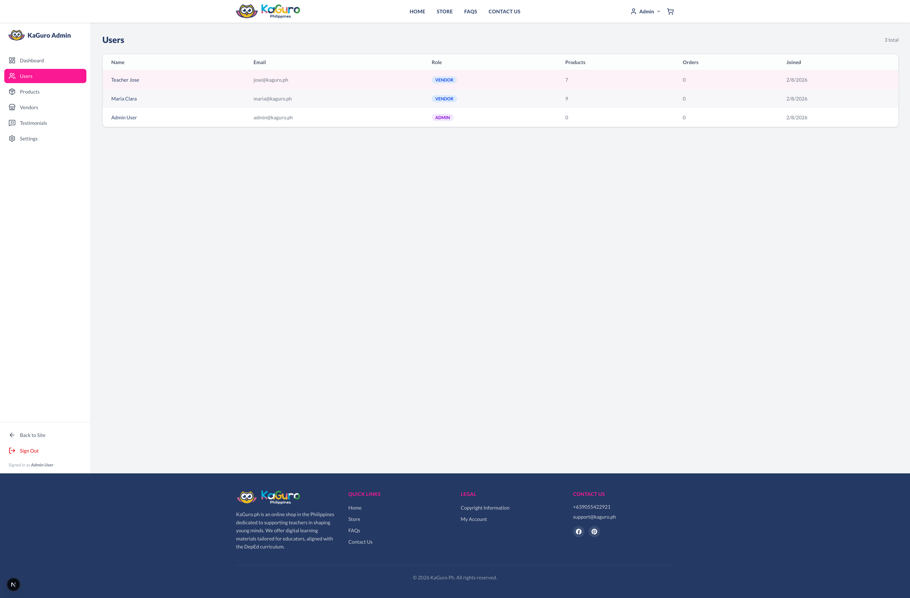

#### Admin Panel - Products
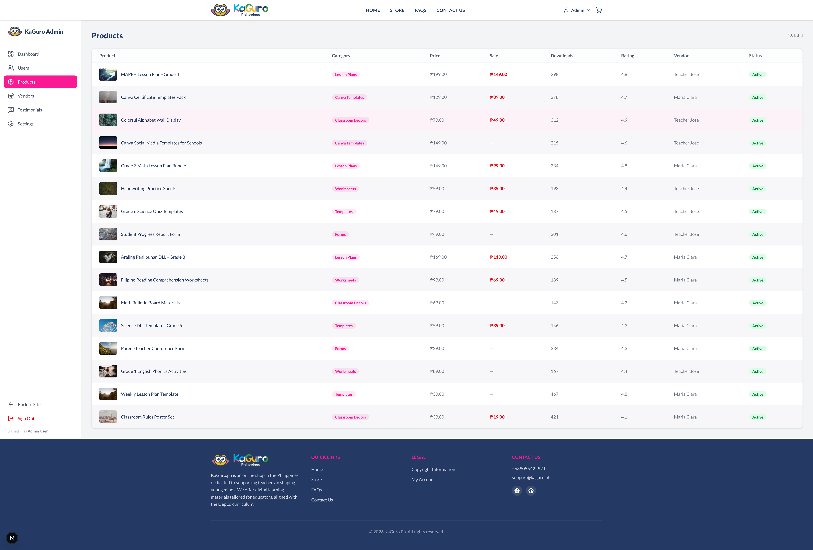

#### Admin Panel - Vendors
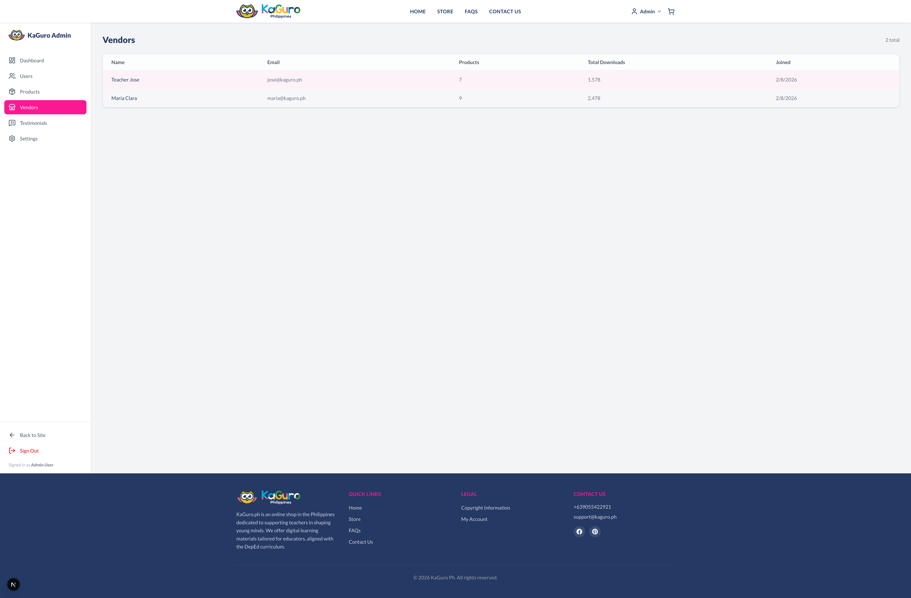

#### Admin Panel - Testimonials
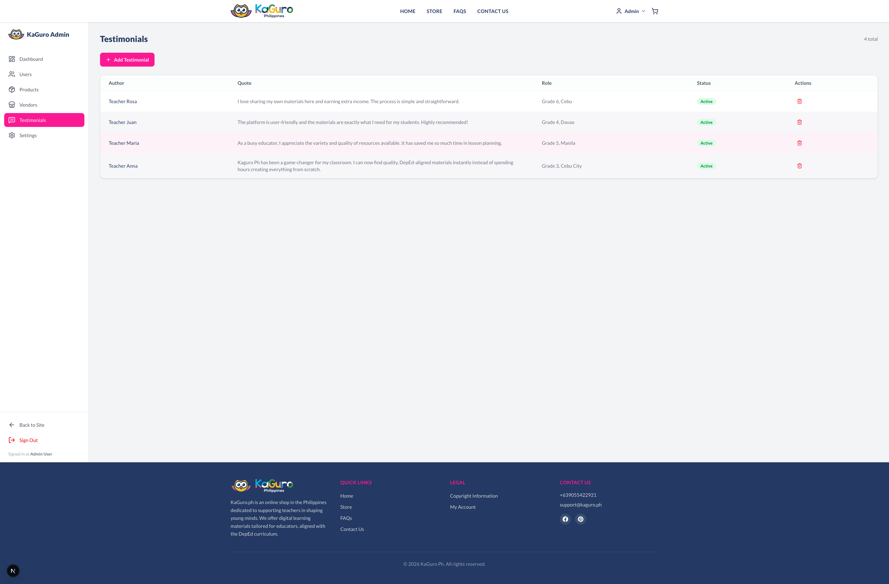

#### Admin Panel - Settings
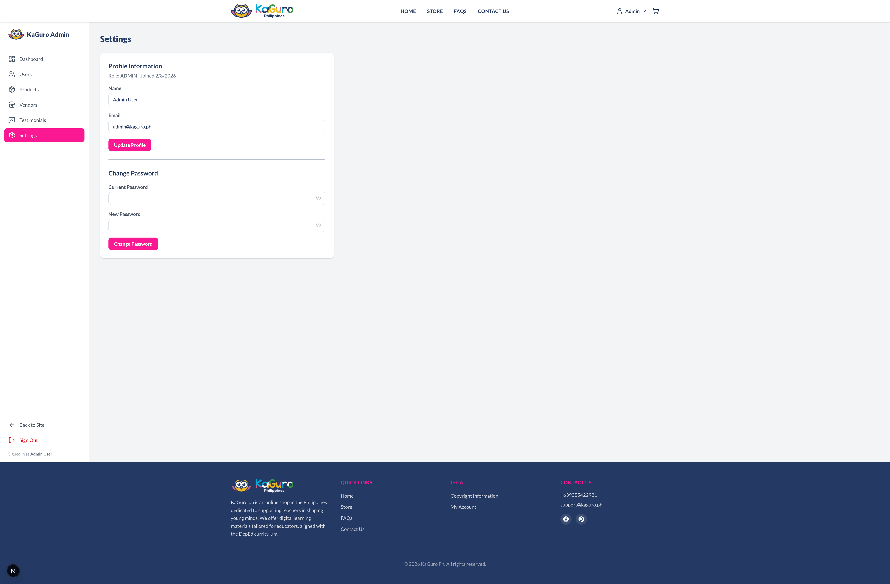
