# Tastea & More

A modern tea shop web application built with Angular 21 and Tailwind CSS v4. Customers can browse the menu, add items to their cart, choose between online pickup or dine-in, select a payment method, place orders, and receive a digital receipt. An admin dashboard lets staff track and manage all incoming orders in real time.

## Tech Stack

| Technology | Version | Purpose |
|------------|---------|---------|
| Angular | 21 | Frontend framework (standalone components, signals) |
| TypeScript | 5.9 | Type-safe language |
| Tailwind CSS | 4 | Utility-first styling via `@tailwindcss/postcss` |
| Angular Router | 21 | Client-side routing with route guards |
| RxJS | 7.8 | Reactive event streams (router events) |
| Jest | 30 | Unit testing |
| Google Fonts | — | Satisfy (headings), Poppins (body) |

## Getting Started

### Prerequisites

- Node.js 20+
- npm 10+

### Installation

```bash
cd tastea
npm install
```

### Development Server

```bash
npm start
```

Navigate to `http://localhost:4201`. The app reloads automatically on file changes.

### Production Build

```bash
npm run build
```

Build artifacts are stored in `dist/tastea/`.

### Running Tests

```bash
npm test
```

## Demo Admin Credentials

| Field | Value |
|-------|-------|
| Username | `admin` |
| Password | `tastea2024` |

Access the admin login at `/admin/login`. Once authenticated, you'll be redirected to the order dashboard at `/admin`.

## Features

### Customer-Facing

- **Home page** — Full-screen banner background image behind a semi-transparent gradient overlay, featured items, value propositions, and CTAs
- **Menu browsing** — 24 curated items across Tea, Coffee, and Pastry categories with subcategory chip filtering
- **Shopping cart** — Real-time cart badge in header, quantity controls, special instructions, subtotal/tax/total calculations
- **Checkout** — Customer details form, order type selection (Online Pickup / Dine-In), payment method selection (Card / Cash)
- **Digital receipt** — Itemized order with store branding, order number, totals, and current order status
- **Responsive design** — Fully responsive layout with mobile hamburger navigation

### Admin

- **Login page** — Secure authentication with banner background image and dark overlay
- **Order dashboard** — Real-time stats cards (total orders, pending, preparing, ready, revenue)
- **Order filtering** — Filter by type (All / Online / Dine-In) and status (pending, preparing, ready, completed, cancelled)
- **Order management** — Progress orders through statuses (Pending → Preparing → Ready → Completed) or cancel them
- **Reports** — Sales analytics with Daily, Monthly, and Yearly breakdowns, showing online vs. dine-in revenue
- **Header integration** — Admin/Dashboard link in header nav, solid white header background on admin pages

## Routes

| Path | Page | Access |
|------|------|--------|
| `/` | Home | Public |
| `/menu` | Menu | Public |
| `/about` | About Us | Public |
| `/contact` | Contact | Public |
| `/cart` | Shopping Cart | Public |
| `/checkout` | Checkout | Public |
| `/receipt/:orderNumber` | Order Receipt | Public |
| `/admin/login` | Admin Login | Public |
| `/admin` | Admin Dashboard | Protected (auth guard) |
| `/admin/reports` | Sales Reports | Protected (auth guard) |

## Project Structure

```
src/app/
├── components/              # Reusable UI components
│   ├── header/              # Fixed header with nav, cart badge, admin link
│   ├── footer/              # Site footer with links, contact info & hours
│   ├── menu-card/           # Menu item card with add-to-cart button
│   └── cart-item/           # Cart line item with quantity controls
├── pages/                   # Route-level page components
│   ├── home/                # Hero banner, featured items, values, CTA
│   ├── menu/                # Full menu with category & subcategory filtering
│   ├── about/               # Story, values, team bios
│   ├── contact/             # Contact form & info cards
│   ├── cart/                # Shopping cart review & order summary
│   ├── checkout/            # Order form with type & payment selection
│   ├── receipt/             # Digital receipt after order placement
│   ├── admin-login/         # Admin authentication page
│   └── admin-dashboard/     # Order management dashboard
├── services/
│   ├── cart.service.ts      # Signal-based cart state management
│   ├── order.service.ts     # Order tracking, filtering & status updates
│   └── auth.service.ts      # Admin authentication (login/logout)
├── guards/
│   └── auth.guard.ts        # CanActivate guard for admin routes
├── models/
│   └── menu.model.ts        # TypeScript interfaces & union types
├── data/
│   └── menu-data.ts         # 27 hardcoded menu items
├── app.routes.ts            # Route configuration with guard
├── app.config.ts            # App providers
├── app.ts                   # Root component (header + router-outlet + footer)
└── styles.css               # Global Tailwind theme (custom palette & fonts)
```

## Menu

### Teas (12 items)
Green, Black, Herbal, Oolong, White, and Chai — from Classic Matcha Latte to Spiced Chai Latte. Price range: $3.75–$5.75.

### Coffees (6 items)
Hot, Iced, and Blended — from House Blend Pour-Over to Matcha Espresso Fusion. Price range: $4.00–$6.25.

### Pastries (6 items)
Scones, Cakes, Cookies, and Pastries — from Classic Butter Scone to Chocolate Croissant. Price range: $3.25–$6.50.

## Architecture Highlights

- **Standalone Components** — No NgModules; all components use Angular's standalone API
- **Signal-based State** — Services use `signal()` and `computed()` for reactive state management across cart, orders, and auth
- **Route Guards** — `CanActivateFn` guard protects admin dashboard; redirects unauthenticated users to login
- **Input/Output Signals** — Components communicate via `input()` and `output()` signal APIs
- **Template-driven Forms** — FormsModule with `[(ngModel)]` for checkout, contact, and login forms
- **Modern Control Flow** — Uses `@if`, `@for`, `@else` syntax throughout templates
- **Router Events** — Header listens to `NavigationEnd` events to apply solid background on admin pages

## Color Palette

| Name | Role | Base Hex |
|------|------|----------|
| Primary (Blush Pink) | Buttons, accents, highlights | `#f2a09a` |
| Secondary (Tea Leaf Green) | Badges, nature accents | `#97ab3f` |
| Accent (Charcoal) | Text, borders, dark UI | `#2a2a2a` |


## Video Demo

- Watch the demo: [YouTube](https://youtu.be/4f9XHiINqmI)


### Screenshots

#### Home


#### Menu


#### About


#### Contact
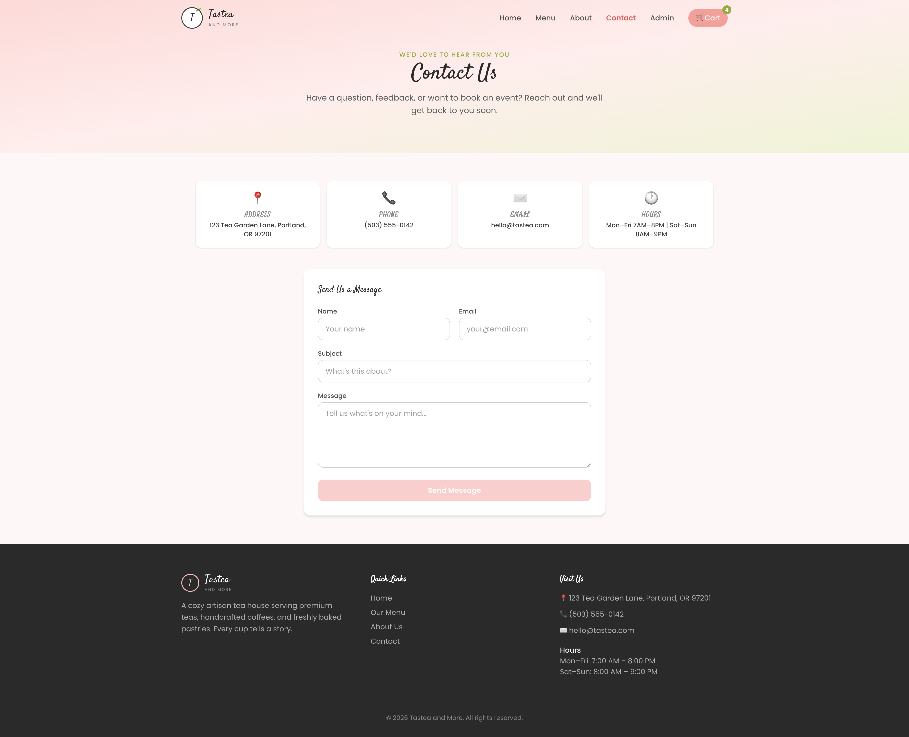

#### Send Message
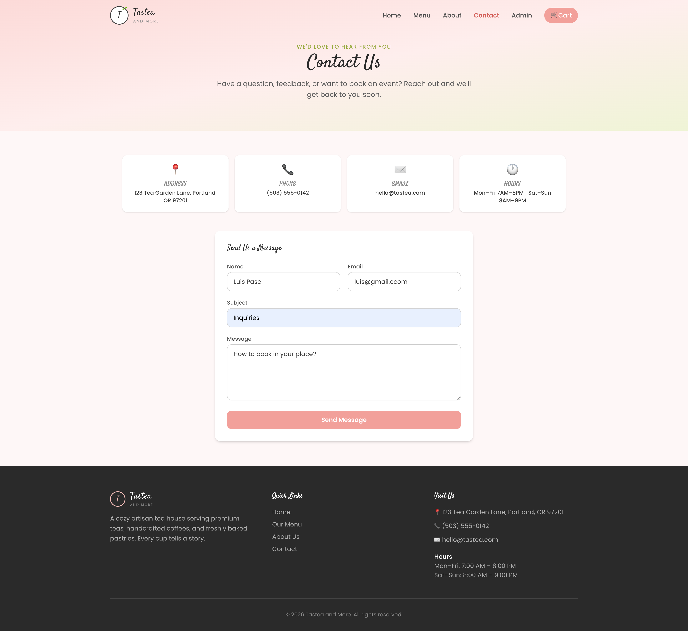
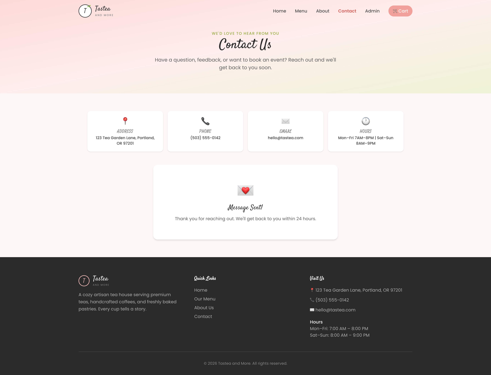

#### Cart with orders
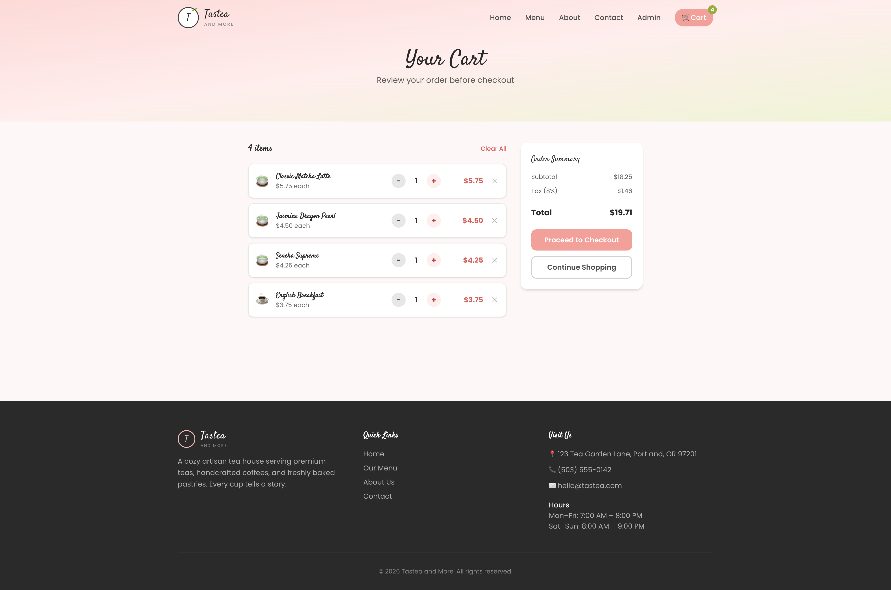

#### Cart without orders
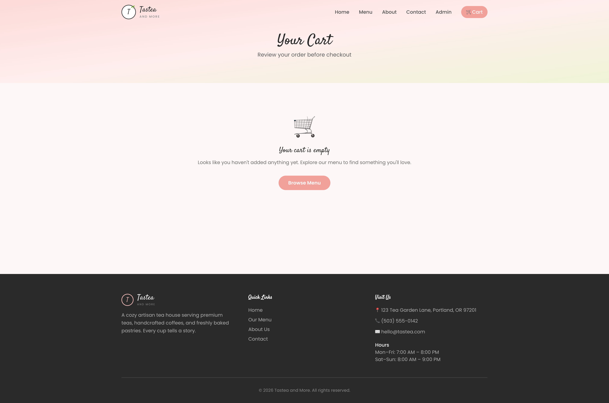

#### Order Checkout
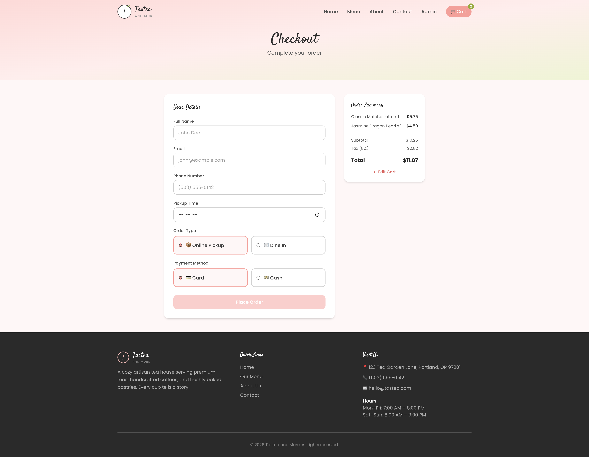

#### Order Receipt
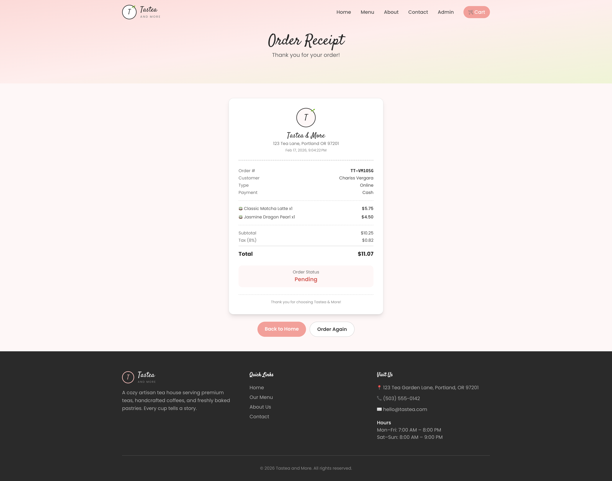

#### Administrator Login


#### Order Dashboard without Orders
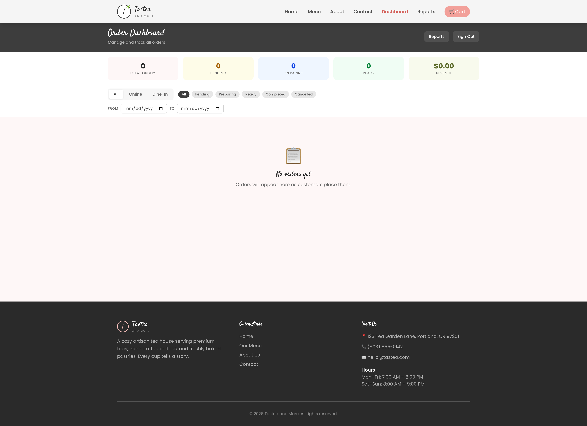

#### Order Dashboard with Orders
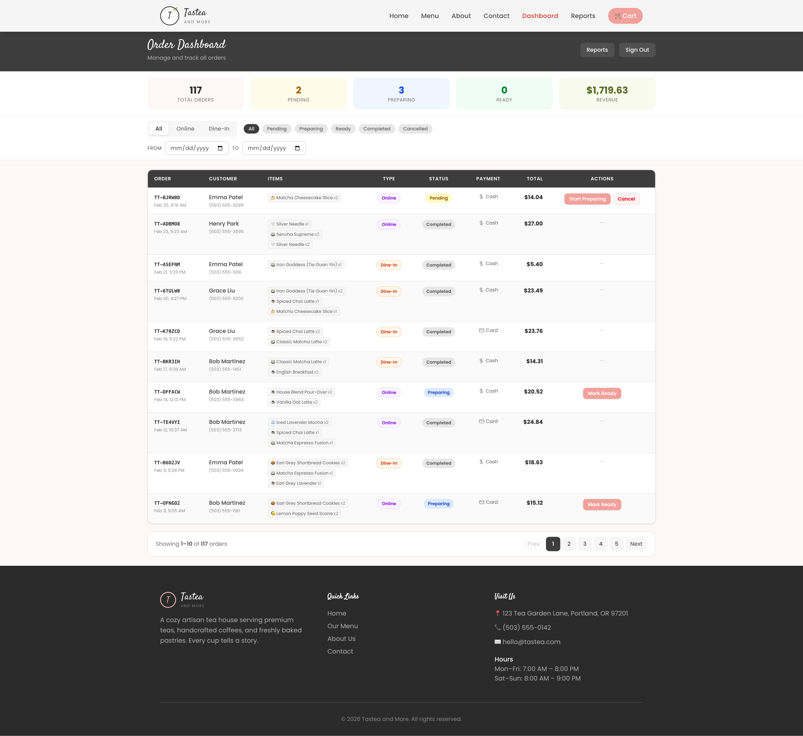

#### Reports - Daily
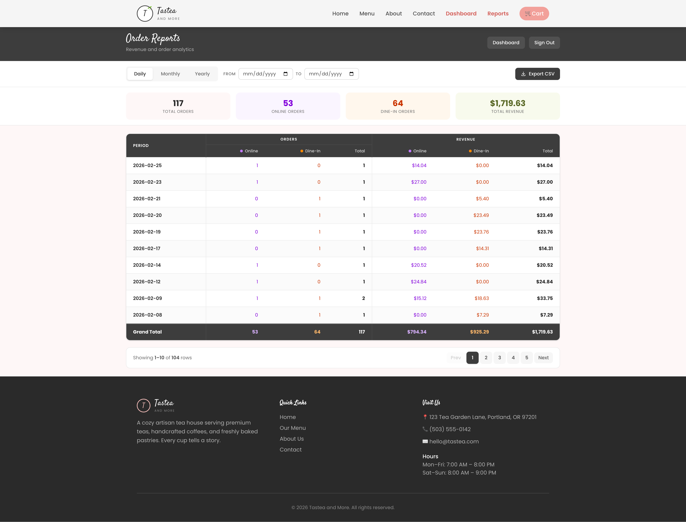

#### Reports - Monthly
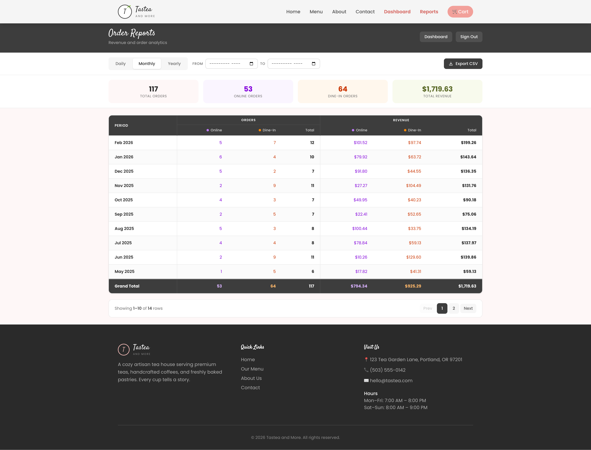

#### Reports - Yearly
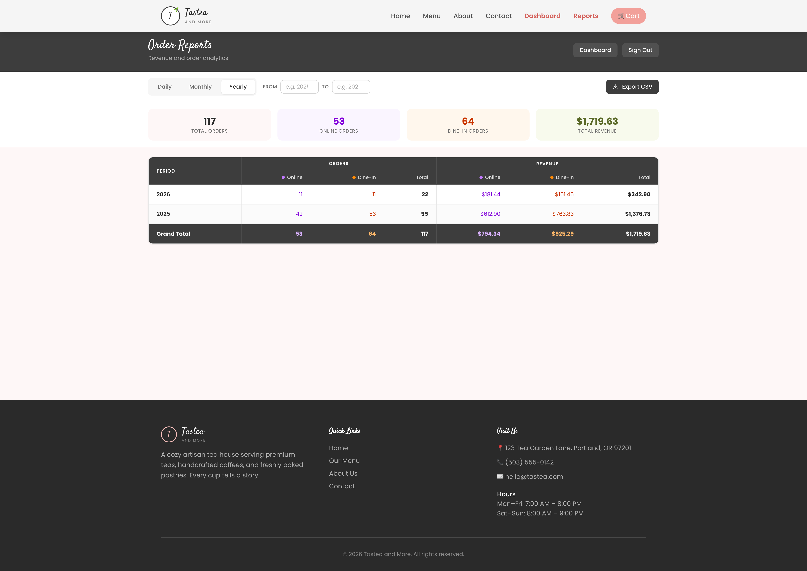